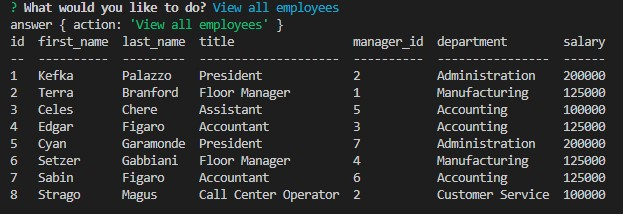

# employee_tracker
# Solution for Module 12 Challenge

This script has been created as a command line based tool for maintaining a basic employee database.  The tables include Departments, Roles, and Employees.  

  
[Click for demonstration video]()  
[Link to GitHub Repo](https://github.com/fryylord/employee_tracker)  

- [Installation](#installation)
- [Usage](#usage)
- [Credits](#credits)
- [License](#license)

## Installation

In the command line in the root directory, type npm install allowing for the required libraries to be installed

## Usage

The application can be inisitialized by typing node index.js within the directory in which it resides.  

After running the program the user is prompted with the following requests :  

View all employees  
Add employee  
Update employee role  
Update manager for employee  
View all roles  
Add a role  
View all departments  
Add a department  
Delete an employee  

Depending on the action taken, the employee database will be updated accordingly.

## Credits

https://ku.bootcampcontent.com/ku-coding-boot-camp/KU-VIRT-FSF-PT-09-2022-U-LOLC/  
https://github.com/nicolewallace09/employee-tracker  
https://github.com/cmelby/EmployeeTracker   
https://github.com/jpd61/employee-tracker

## License
 
MIT License

Copyright (c) 2022 fryylord

Permission is hereby granted, free of charge, to any person obtaining a copy
of this software and associated documentation files (the "Software"), to deal
in the Software without restriction, including without limitation the rights
to use, copy, modify, merge, publish, distribute, sublicense, and/or sell
copies of the Software, and to permit persons to whom the Software is
furnished to do so, subject to the following conditions:

The above copyright notice and this permission notice shall be included in all
copies or substantial portions of the Software.

THE SOFTWARE IS PROVIDED "AS IS", WITHOUT WARRANTY OF ANY KIND, EXPRESS OR
IMPLIED, INCLUDING BUT NOT LIMITED TO THE WARRANTIES OF MERCHANTABILITY,
FITNESS FOR A PARTICULAR PURPOSE AND NONINFRINGEMENT. IN NO EVENT SHALL THE
AUTHORS OR COPYRIGHT HOLDERS BE LIABLE FOR ANY CLAIM, DAMAGES OR OTHER
LIABILITY, WHETHER IN AN ACTION OF CONTRACT, TORT OR OTHERWISE, ARISING FROM,
OUT OF OR IN CONNECTION WITH THE SOFTWARE OR THE USE OR OTHER DEALINGS IN THE
SOFTWARE.

## Features

Command line interface  
Multiple libraries used  
Multiple options for navigating and altering the database  
Adaptable coding format for potential growth  

## Tests

None